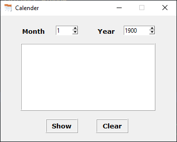

# Calender-GUI 

 
A Dictionary GUI App Made Using Python 3.9.0 .
Hope You Will Like It and you can also use the code to make your own version.

>### To Run, simply double click on the **Calender_gui.exe**.
## Requirements
1.  tkinter
2.  calendar  —  An Inbuilt Module 

---
## Project Demo

### Show some ❤️ by starring the repository!

